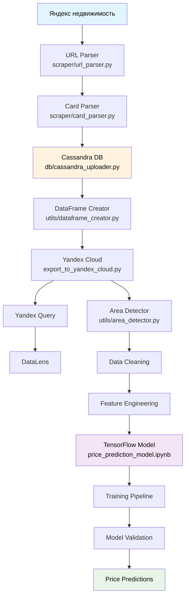

# Система предсказания цен на недвижимость в Уфе
## Архитектура системы



## Компоненты системы

### 1. **Скрейпинг данных** (`scraper/`)
- **`url_parser.py`** - Парсинг url объявлений
- **`card_parser.py`** - Извлечение информации о квартирах
- **`scraper.py`** - Основной модуль объединяющий парсеры

### 2. **Хранение данных** (`db/`)
- **`cassandra_uploader.py`** - Загрузка и выгрузка данных в/из Cassandra
- Поддержка локального JSON хранения
- Интеграция с Yandex Cloud Object Storage

### 3. **Обработка данных** (`utils/`)
- **`dataframe_creator.py`** - Создание DataFrame 
- **`area_detector.py`** - Определение районов города по координатам/адресам

### 4. **Yandex Cloud** (`yandex_uploader/`)
- **`uploader.py`** - Загружает файл в Yandex Object Storage
- **`export_to_yandex_cloud`** - Загружает данные из Cassandra для выгрузки в Yandex Object Storage

### 4. **ML модель** (`price_prediction_model.ipynb`)
- Модель регрессии на TensorFlow
- Предобработка данных (StandardScaler, LabelEncoder)
- Обучение и валидация модели
- Метрики качества (MAE, MSE, R²)

## Быстрый старт

### 1. Настройка переменных окружения
Создайте файл `.env` на основе `.env.example`

### 2. Запуск Cassandra 
#### Используйте гайд по установке на Windows  
📖 [Apache Cassandra Habr](https://habr.com/ru/articles/465151/)   
#### Либо используйте официальный Docker образ Apache Cassandra:  
🐳 [Apache Cassandra Docker](https://hub.docker.com/_/cassandra)

### 3. Запуск компонентов
```bash
# 1. Сбор данных и загрузка в Cassandra
python scraper/scraper.py

# 2. Отправка в Yandex Cloud
python yandex_uploader/export_to_yandex_cloud.py

# 3. Предсказания цен на недвижимость
python price_prediction_model.py
```

## Настройка аналитики и визуализации в Yandex Cloud

#### Создание бакета в Yandex Cloud
📺 [Видео-инструкция по созданию бакета](https://youtu.be/_d-EPZ-X_Qo?si=-DYmmiyEWNRvTeqX)

#### Подключение DataLens к Yandex Query
📖 [Официальная документация](https://yandex.cloud/ru/docs/tutorials/datalens/data-from-yandex-query-visualization)